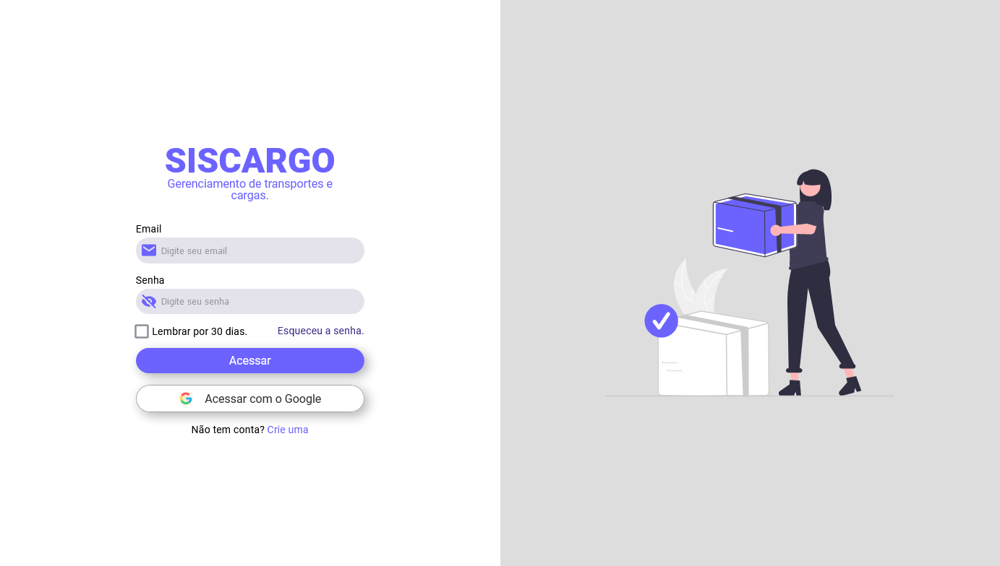

# CARGO LOGIN PAGE

### Login Page



## Installation

```sh
# Install and run the packages
npm install

npm run dev

```

## Contributing

Pull requests are welcome. For major changes, please open an issue first
to discuss what you would like to change.

Please make sure to update tests as appropriate.

## Authors

Marcelo Marcon

## License

[MIT](https://choosealicense.com/licenses/mit/)
